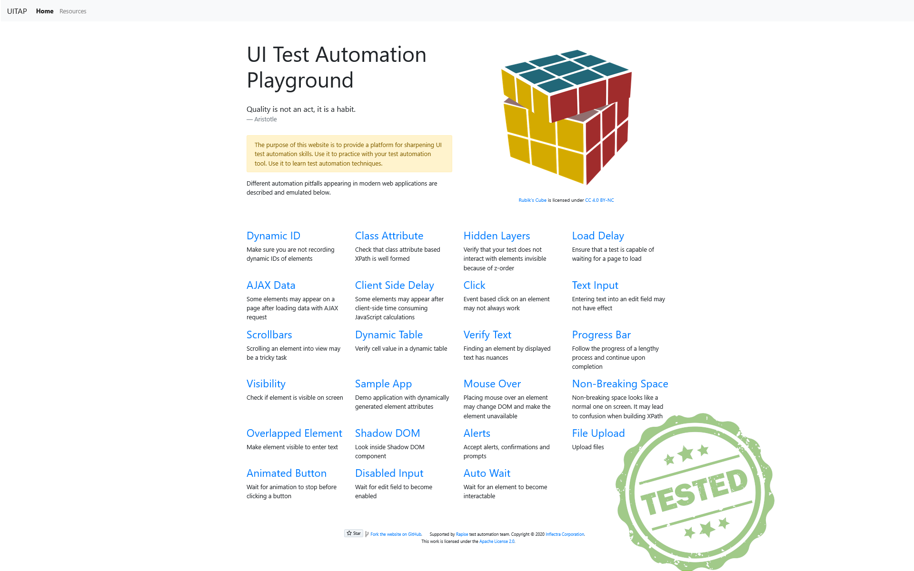

# Playwright Practice Project

This project is a practice setup for using Playwright with Python. It includes various dependencies and tools to help automate and test web applications.

## Built with:

[](https://www.python.org/)

[](https://docs.pytest.org/)

[](https://playwright.dev/)


[](https://www.mozilla.org/firefox/)

## Cloning the Repository

To clone this repository, use the following command:

```bash
git clone https://github.com/your-username/Playwright_practice.git
cd Playwright_practice
```

## Requirements

The project dependencies are listed in the `requirements.txt` file. To install them, you can use the following command:

```bash
pip install -r requirements.txt
```

## Usage

To run the Playwright tests, you can use the following command:

```bash
pytest test_automation_playground.py
```

Make sure you have the necessary browsers installed for Playwright. You can install them using:

```bash
playwright install
```

## Project Structure

- `test_automation_playground.py`: Contains the Playwright test scripts.
- `conftest.py`: Contains the pytest fixtures for setting up and tearing down Playwright sessions.
- `session.py`: Defines the `PlaywrightSession` class used to manage Playwright sessions, allowing all test runs to occur in the same window without closing, except when the session ends.

